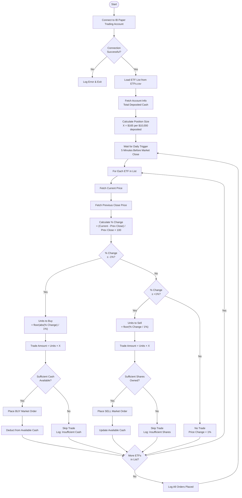

# Algorithmic_Trading
Algorithmic trading script using Interactive Brokers (ibapi) on a paper trading account.

## Strategy Overview

Buys 2x leveraged sector and bond ETFs when they drop and sells them when they rise, executing 5 minutes before market close each trading day.

## Flow Chart



## Position Sizing

| Total Deposited Cash | Trade Size per 1% Move (X) |
|---|---|
| $10,000 | $165 |
| $20,000 | $330 |
| $50,000 | $825 |
| $100,000 | $1,650 |

**Formula:** `X = (Total Deposited Cash / $10,000) × $165`

## ETFs

2x leveraged sector and bond ETFs (see `ETFs.csv` for full list):

| Symbol | Sector |
|---|---|
| DIG | Oil & Gas |
| LTL | Bonds |
| ROM | Real Estate |
| RXL | Healthcare |
| UBT | Bonds |
| UCC | Consumer |
| UGE | Energy |
| UJB | Bonds |
| UPW | Utilities |
| URE | Real Estate |
| UST | Stocks (Short) |
| UXI | Financials |
| UYG | Financials |
| UYM | Materials |

## Architecture

```
algorithmic_trading/
├── config.py          # Settings, constants, ETF list loader
├── account.py         # IB account connection, cash/position queries
├── market_data.py     # Price fetching (current & previous close)
├── strategy.py        # % change calculation, trade signal generation
├── order_manager.py   # Market order placement via ibapi
├── scheduler.py       # Daily trigger 5 min before market close
└── main.py            # Entry point, orchestration
```

## Setup

### Prerequisites

- Python 3.9+
- Interactive Brokers TWS or IB Gateway (paper trading account)
- `ibapi` Python client

### Installation

1. **Clone the repository:**
   ```bash
   git clone <repo-url>
   cd Algorithmic_Trading
   ```

2. **Install dependencies:**
   ```bash
   pip install ibapi
   ```

3. **Configure Interactive Brokers:**
   - Open TWS or IB Gateway
   - Log in to your **paper trading** account
   - Enable API connections: *File > Global Configuration > API > Settings*
     - Check "Enable ActiveX and Socket Clients"
     - Set Socket Port to `7497` (paper trading default)
     - Check "Allow connections from localhost only"

4. **Run the script:**
   ```bash
   python main.py
   ```

### Important Notes

- **Paper trading only.** This script is configured exclusively for paper trading accounts (port 7497). Do not connect it to a live account.
- The script runs continuously and executes the strategy once per day, 5 minutes before market close (3:55 PM ET).
- Available cash is checked before every buy order. Trades are skipped if cash is insufficient.
- All orders are market orders executed at the prevailing price.
