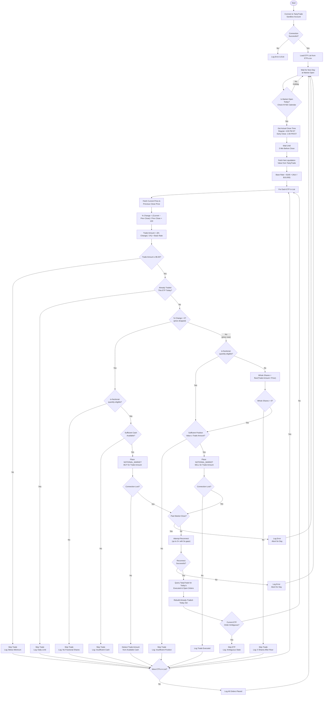

# Algorithmic_Trading
Algorithmic trading script using the tastytrade API on a sandbox (paper trading) account.

## Strategy Overview

Buys 2x leveraged sector ETFs when they drop and sells them when they rise, executing 5 minutes before market close each trading day.

## Flow Chart



## Position Sizing

Trade amount scales linearly with both the % price change and account net liquidation value, queried live from TastyTrade at execution time. Minimum trade size is $5.00.

**Formula:** `Trade Amount = (|% Change| / 1%) × $165 × (Net Liquidation Value / $10,000)`

| % Change | $10,000 NLV | $20,000 NLV | $50,000 NLV |
|---|---|---|---|
| 0.5% | $82.50 | $165.00 | $412.50 |
| 1.0% | $165.00 | $330.00 | $825.00 |
| 2.0% | $330.00 | $660.00 | $1,650.00 |
| 3.5% | $577.50 | $1,155.00 | $2,887.50 |

## ETFs

2x leveraged sector ETFs (see `ETFs.csv` for full list):

| Symbol | Description |
|---|---|
| DIG | Energy |
| LTL | Communication Services |
| ROM | Technology |
| RXL | Health Care |
| UCC | Consumer Discretionary |
| UGE | Consumer Staples |
| UPW | Utilities |
| URE | Real Estate |
| UXI | Industrials |
| UYG | Financials |
| UYM | Materials |

## Architecture

```
Algorithmic_Trading/
├── main.py            # Entry point — asyncio event loop, daily orchestration
├── config.py          # Constants, ETF list loader, credentials from .env
├── scheduler.py       # NYSE calendar, close-time detection, trigger timing
├── account.py         # TastyTrade session, balances, order placement
├── market_data.py     # Batch price fetching, % change computation
├── strategy.py        # Trade sizing, direction (buy on drops, sell on rises)
├── order_manager.py   # Traded-today tracking, connection recovery, execution
├── ETFs.csv           # List of 2x leveraged sector ETFs
├── requirements.txt   # Python dependencies
├── .env.example       # Credential template (copy to .env)
└── traded_today.json  # Runtime state (auto-generated, not committed)
```

## Setup

### Prerequisites

- Python 3.11+
- A tastytrade developer account and sandbox (paper trading) credentials

### Step 1: Clone the repository

```bash
git clone <repo-url>
cd Algorithmic_Trading
```

### Step 2: Create a virtual environment (recommended)

```bash
python -m venv venv
source venv/bin/activate   # Linux/macOS
# venv\Scripts\activate    # Windows
```

### Step 3: Install dependencies

```bash
pip install -r requirements.txt
```

### Step 4: Set up tastytrade OAuth credentials

The script uses OAuth2 authentication with the tastytrade API. You need a **provider secret** (client secret) and a **refresh token**.

1. **Create a sandbox account** at [developer.tastytrade.com/sandbox/](https://developer.tastytrade.com/sandbox/)
2. **Create an OAuth application** at the developer portal
   - Set the callback URL to `http://localhost:8000`
3. **Save the client secret** (provider secret) generated during app creation
4. **Create a grant** (refresh token) from the OAuth Applications section
5. **Copy `.env.example` to `.env`** and fill in both values:

```bash
cp .env.example .env
```

Edit `.env`:
```
TASTYTRADE_PROVIDER_SECRET=your_oauth_client_secret
TASTYTRADE_REFRESH_TOKEN=your_refresh_token
```

Refresh tokens never expire, so this is a one-time setup.

### Step 5: Run the script

```bash
python main.py
```

The script runs continuously:
- On each trading day, it waits until 5 minutes before market close
- Executes the strategy for all ETFs in `ETFs.csv`
- Sleeps until the next trading day

### Important Notes

- **Sandbox account only.** The `SANDBOX = True` flag in `config.py` ensures the script always connects to `api.cert.tastyworks.com`. Never change this to `False` or use live account credentials.
- The script handles early-close days automatically (e.g., Christmas Eve at 1:00 PM ET).
- If the connection drops during execution, the script retries up to 3 times with 5-second gaps. After reconnecting, it rebuilds the traded-today set from TastyTrade to avoid duplicate orders.
- All orders use `NOTIONAL_MARKET` (dollar-amount) orders for ETFs that support fractional shares. For non-eligible ETFs, buys are skipped and sells are floored to whole shares.
- Sell proceeds settle T+1 and are **not** available for same-day buys. The cash guard only tracks same-day buy spend.
- The `traded_today.json` file persists the list of ETFs already traded each day, so the script can safely restart without double-trading.
- Logs are printed to stdout. Redirect to a file for persistent logging:
  ```bash
  python main.py >> trading.log 2>&1
  ```
